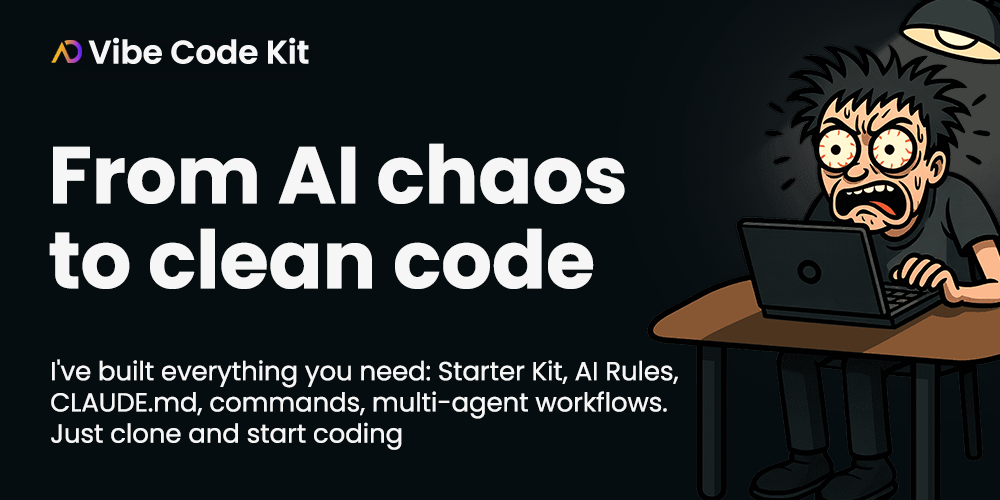

<a href="https://vibecodekit.dev">

</a>

<p align="center">
<strong>🏆 Need advanced features?</strong> Check out the PRO version with early access and lifetime license<br>
→ <a href="https://vibecodekit.dev">vibecodekit.dev</a><br>
<strong>💎 Use code <code>CCBLUEPRINT</code> for 10% OFF</strong>
</p>

# 🏗️ Blueprint-Driven Claude Code Autopilot
> **Claude Code Plugin for smart blueprint-driven development**
>
> AI analyzes patterns, creates solid implementation plans, delivers working code in 15 minutes

[](https://github.com/croffasia/cc-blueprint-toolkit)
[](https://opensource.org/licenses/MIT)
[](https://claude.ai/code)
[](https://www.threads.com/@opensourcealternatives)

Blueprint-driven development plugin: AI analyzes your codebase patterns, creates comprehensive implementation plans, then delivers production-ready code with tests. Smart preparation over endless iterations.

```bash
/bp:init
# → Automatically installs/updates templates in your project → docs/templates/*

/bp:brainstorm Add user authentication with OAuth2
# → Smart feature planning session → docs/brainstorming/2025-08-22-user-auth.md

/bp:generate:prp @docs/brainstorming/2025-08-22-user-auth.md
# OR directly: /prp:generate Add user authentication with OAuth2
# → Complete implementation blueprint → docs/prps/user-auth.md

/bp:execute:prp @docs/prps/user-auth.md
# → Working auth system (direct PRP execution for simple features)

/bp:execute:task @docs/tasks/user-auth.md
# → Execute all tasks from breakdown (for complex features)
```

**Before**: 2-4 hours of coding, debugging, and integration  
**After**: 15 minutes → Production-ready feature ✨

> ⭐ **Found this helpful? Star the repo and hit Watch** to get notified of new updates!

## ❤️ Why Developers Love It

- **10x Faster Development** - Feature idea to production in one session
- **Zero "Vibe Coding"** - AI follows your exact patterns and conventions
- **Smart Research** - Finds patterns in your codebase or searches dev resources for best practices when needed
- **Auto Task Breakdown** - Complex features automatically split into manageable step-by-step tasks
- **Any Tech Stack** - React, Python, Go, PHP - works everywhere

## 🚀 Quick Start

### Installation (2 simple steps)

**Step 1: Install Plugin**

In Claude Code console, run:
```bash
# Short format
/plugin marketplace add croffasia/cc-blueprint-toolkit

# Or full URL
/plugin marketplace add https://github.com/croffasia/cc-blueprint-toolkit.git
```

**Step 2: Initialize Templates**

In your project directory, run once:
```bash
/bp:init
```

This will automatically install documentation templates to your project, enabling the full Blueprint workflow.

## 🎯 Commands

### 1. **Think Through Your Feature** (`/bp:brainstorm`)
- Smart AI Scrum Master guides you through structured planning
- Asks the right questions to uncover hidden requirements
- Creates comprehensive feature documentation → `docs/brainstorming/feature-session.md`
- Perfect for solo developers who need a thinking partner

### 2. **Create Perfect Plan** (`/bp:generate:prp`)
- Validates your request is complete (may ask clarifying questions)
- Studies your codebase patterns
- Researches external docs if needed
- Creates detailed implementation plan → `docs/prps/feature-name.md`
- Breaks down into technical tasks → `docs/tasks/feature-name.md`

### 3. **Execute the Plan** (`/bp:execute:prp`)
- Follows your patterns exactly
- Writes production-ready code
- Runs tests and linting
- Validates everything works

### 4. **Execute Tasks** (`/bp:execute:task`)
- Breaks down complex features into manageable tasks
- Executes task-by-task with validation
- Perfect for large implementations
- Systematic progress tracking

## 🎯 How It Works

### 🧠 Full Feature Development Flow
**brainstorm → generate prp → execute**

1. **Start with Ideas** - Use `/bp:brainstorm` when you need to explore and refine feature concepts
2. **Generate Implementation Plan** - Use `/bp:generate:prp` to create detailed technical specifications  
3. **Choose Your Execution Path**:
   - **Simple Features**: `/bp:execute:prp` - Direct implementation for straightforward tasks
   - **Complex Features**: `/bp:execute:task` - Step-by-step implementation with progress tracking

### 🚀 Quick Implementation Flow
**generate prp → execute**

Skip brainstorming when you have clear requirements:
1. **Generate Plan**: `/bp:generate:prp`
2. **Execute**: Choose `/bp:execute:prp` for simple features or `/bp:execute:task` for complex ones

> **Pro Tip**: Use `/bp:execute:task` for higher quality first-pass implementations on complex features

## 💎 What You Get

### ⚙️ Works With Everything
- **Frontend**: React, Vue, Angular, Svelte
- **Backend**: Node.js, Python, Go, PHP, Java
- **Mobile**: React Native, Flutter, Swift, Kotlin

## 📊 Real Results

- **Development Speed**: Dramatically faster feature delivery
- **Code Quality**: Higher (follows existing patterns)
- **Technical Debt**: Zero (uses established conventions)
- **Completeness**: AI asks clarifying questions to fill gaps
- **Validation**: Built-in linting and project checks

## 📁 What's Included

```
📦 cc-blueprint-toolkit/
├── claude/agents/            # Smart research agents
├── claude/commands/          # Claude Code Commands
├── docs/templates/           # Templates
└── docs/                     # Documentation & guides
    └── vibe-coding-guide.md  # 10 essential tips for AI-powered development
```

## 🎯 Perfect For

- **Solo Developers** - Get team-level productivity + AI thinking partner for feature planning
- **Startups** - Ship features 10x faster with structured planning
- **Large Teams** - Maintain consistency across developers

## 📖 Learning Resources

- **[Vibe Coding Guide](docs/vibe-coding-guide.md)** - 10 essential tips for building projects with AI assistance

## 🏆 Upgrade to PRO

Want production-ready setup with zero configuration?

[](https://www.youtube.com/watch?v=eBMNLzb_w4Q)

### **[Vibe Code Kit PRO](https://vibecodekit.dev)** - Early Access with Lifetime License

💎 **Use code `CCBLUEPRINT` for 10% OFF**

**What's included:**

- **Enhanced PRP Workflow** - Optimized blueprint generation with smarter context handling
- **Smart CLAUDE.md** - Pre-configured with lightweight workflow for routine tasks
- **Context-Aware AI Rules** - Automatically loads relevant rules based on your task
  - Working with styles? Style guidelines and CSS libraries rules auto-loaded
  - API development? Backend patterns and security rules activated
  - Smart context detection eliminates rule overload
  - Modular system lets you customize rules to fit your exact needs
- **Standards Compliance Agent** - Validates code quality and best practices after task completion
- **Professional Vue 3 Starter Kit** - Senior-grade template with Claude Code development rules
  - Pre-configured: ESLint, Prettier, Stylelint, TypeScript, Husky, Docker
  - Zero setup required - works from day one
  - Deploy anywhere instantly

**Perfect for teams and professionals who want enterprise-grade AI development tools without the setup hassle.**

## 🤝 Join the Community

- ⭐ **Star this repo** if it saves you hours
- 🍴 **Fork** to customize for your stack
- 💬 **Issues** for questions and feature requests
- 🔄 **PRs welcome** for new agents and improvements

## 📄 License

MIT License - Use freely in commercial projects

---

**Ready to stop wasting hours on features?** [Install now](#quick-start) and experience autonomous development! 🚀

[](https://github.com/croffasia/cc-blueprint-toolkit)
[](https://opensource.org/licenses/MIT)
[](https://claude.ai/code)
[](https://www.threads.com/@opensourcealternatives)

**v1.4.0** | *Updated: October 12, 2025*